# Examples

This page contains a broader gallery of generated animations.

## Full GIF Gallery

<table>
<tr>
<td align="center" width="25%"> <b>01 Rotating Square</b></td>
<td align="center" width="25%"> <b>02 Bouncing Ball</b></td>
<td align="center" width="25%"> <b>03 Sine Wave Phase</b></td>
<td align="center" width="25%">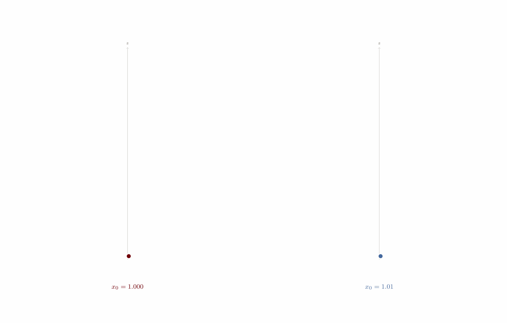 <b>04 Lorenz Attractor</b></td>
</tr>
<tr>
<td align="center" width="25%">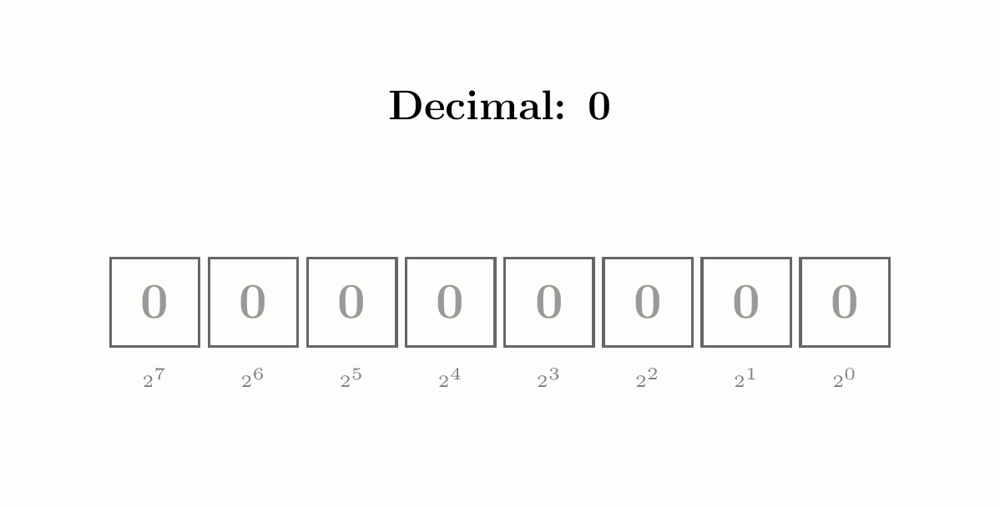 <b>05 Binary Counter</b></td>
<td align="center" width="25%"> <b>06a Bubble Sort</b></td>
<td align="center" width="25%"> <b>06b Selection Sort</b></td>
<td align="center" width="25%"> <b>06c Insertion Sort</b></td>
</tr>
<tr>
<td align="center" width="25%"> <b>07 Mandelbrot Zoom</b></td>
<td align="center" width="25%"> <b>08 Step Response</b></td>
<td align="center" width="25%"> <b>09 EM Wave</b></td>
<td align="center" width="25%"> <b>10 RC Circuit</b></td>
</tr>
<tr>
<td align="center" width="25%"> <b>11 Pendulum</b></td>
<td align="center" width="25%"> <b>12 Gear Train</b></td>
<td align="center" width="25%">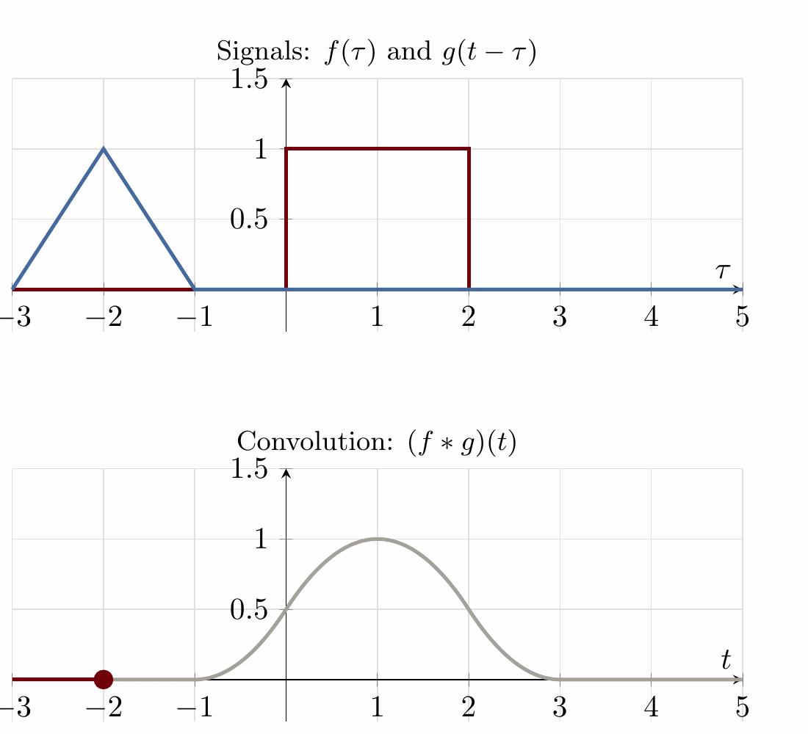 <b>13a Signal Convolution</b></td>
<td align="center" width="25%"> <b>13b Signal Convolution</b></td>
</tr>
<tr>
<td align="center" width="25%">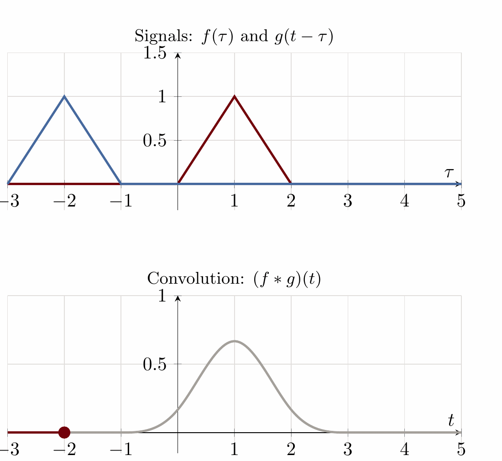 <b>13c Signal Convolution</b></td>
<td align="center" width="25%">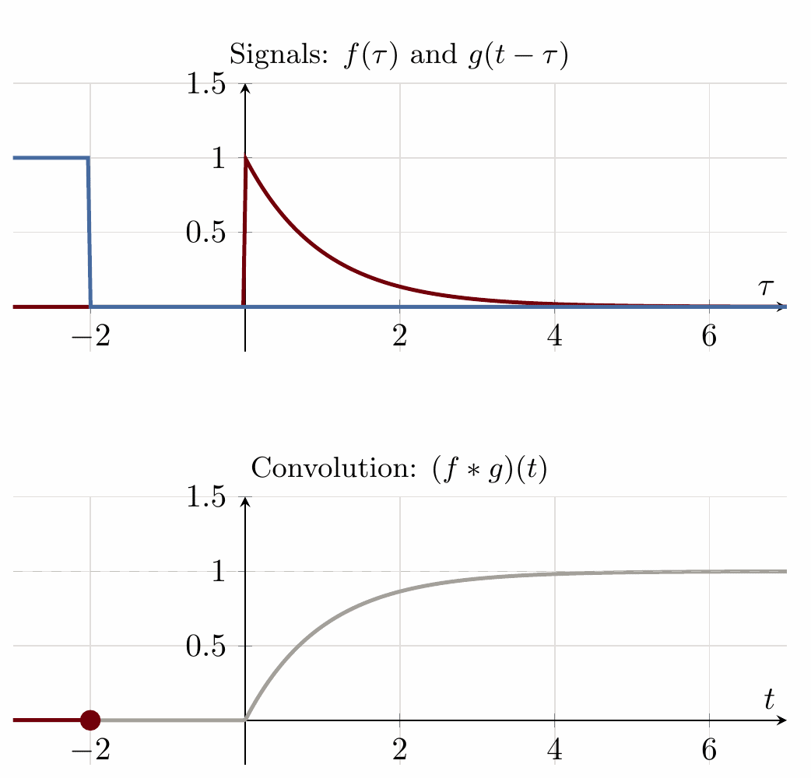 <b>13d Signal Convolution</b></td>
<td align="center" width="25%"> <b>14 Heat Equation</b></td>
<td align="center" width="25%">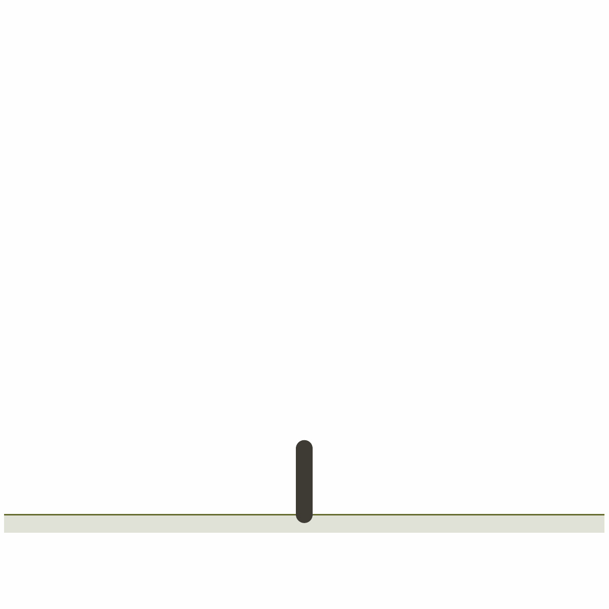 <b>15 Fractal Tree</b></td>
</tr>
<tr>
<td align="center" width="25%"> <b>16 Antenna Radiation</b></td>
<td align="center" width="25%"> <b>17 Bode Plot</b></td>
<td align="center" width="25%">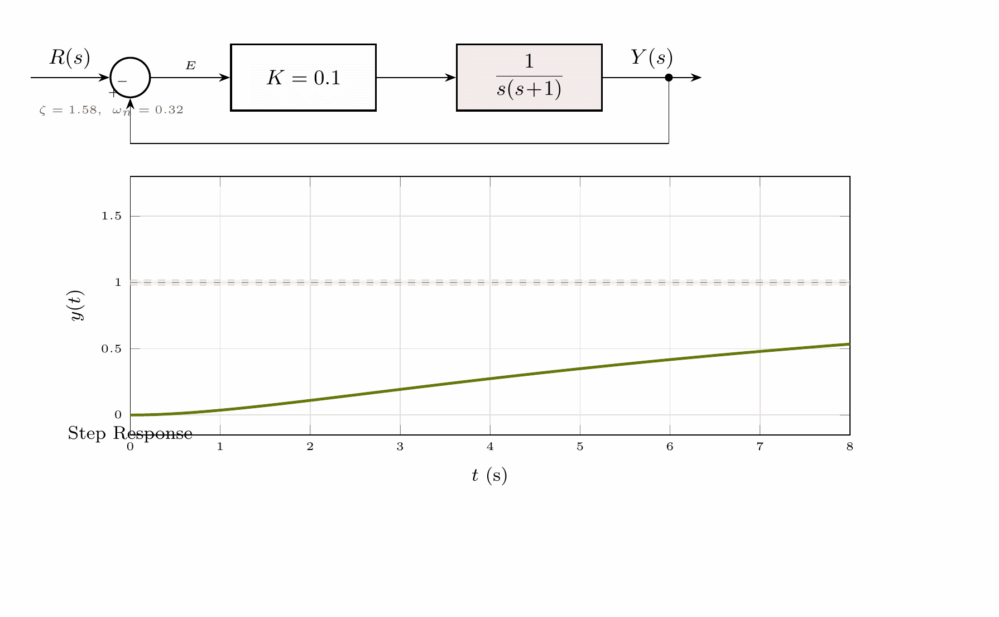 <b>18 Block Diagram Gain Sweep</b></td>
<td align="center" width="25%"> <b>19 Electric Field Lines</b></td>
</tr>
<tr>
<td align="center" width="25%">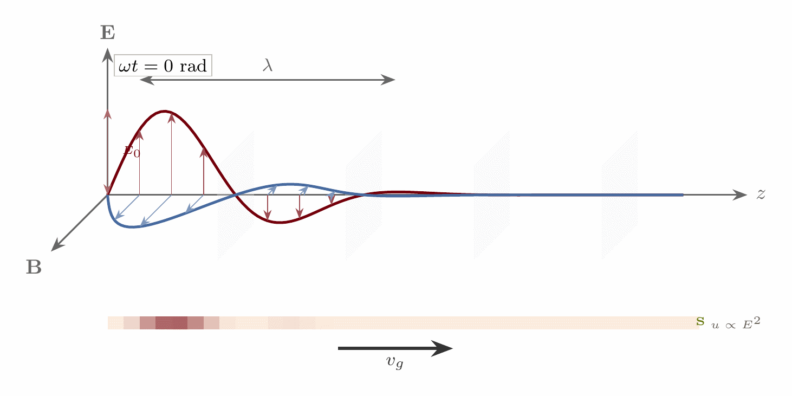 <b>20 EM Wave 3D</b></td>
<td align="center" width="25%"> <b>21 Fourier Series</b></td>
<td align="center" width="25%">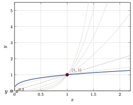 <b>22 Function Family</b></td>
<td align="center" width="25%">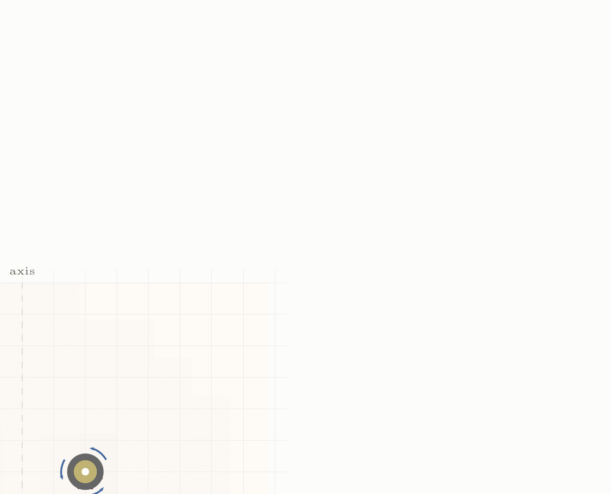 <b>23 Magnetic Field Loop</b></td>
</tr>
<tr>
<td align="center" width="25%">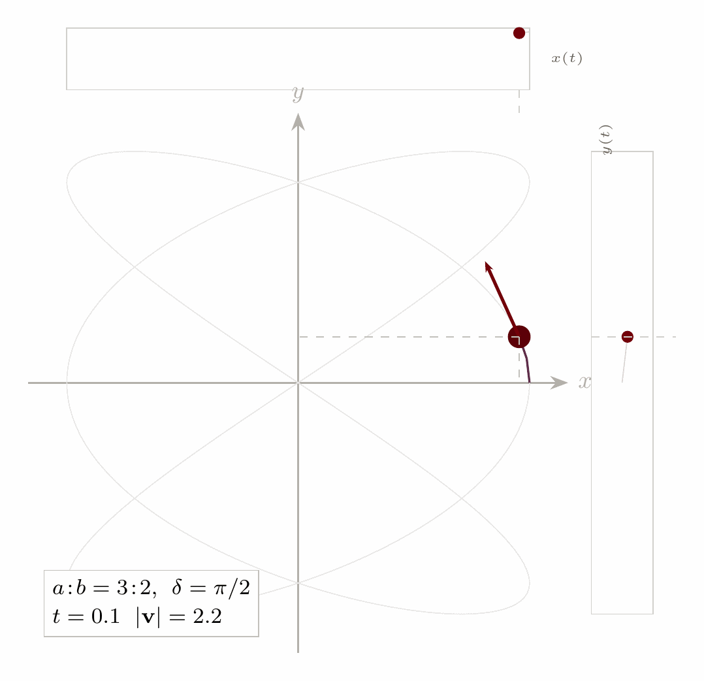 <b>24 Parametric Curve</b></td>
<td align="center" width="25%"> <b>25 Phase Portrait</b></td>
<td align="center" width="25%">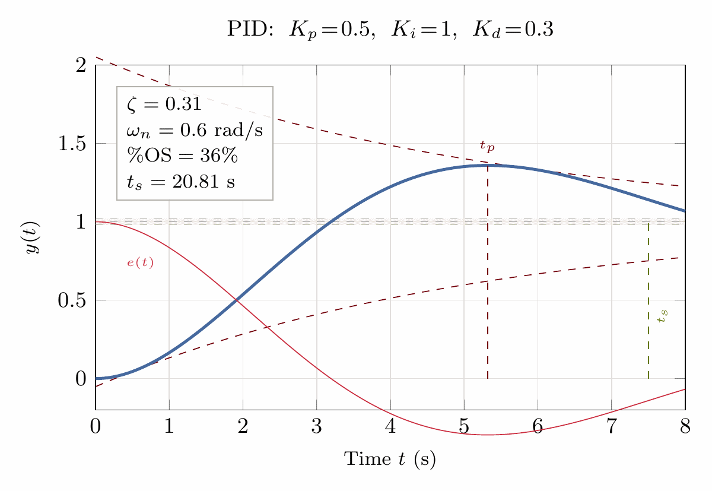 <b>26 PID Tuning</b></td>
<td align="center" width="25%">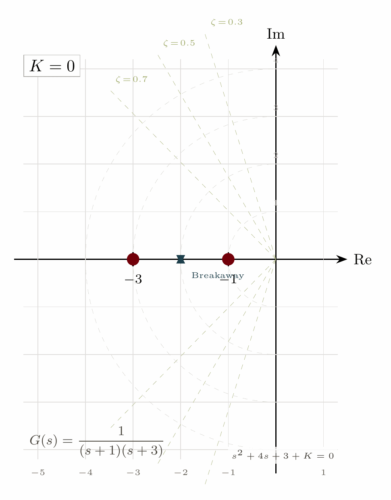 <b>27 Root Locus</b></td>
</tr>
<tr>
<td align="center" width="25%">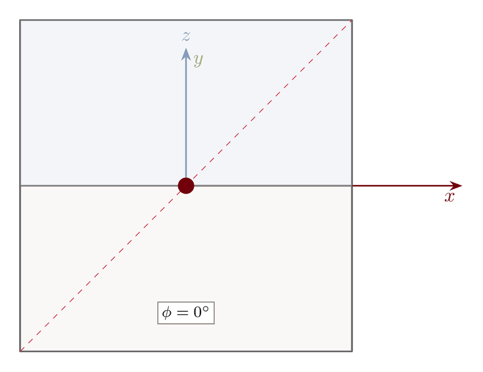 <b>28 Rotation 3D</b></td>
<td align="center" width="25%">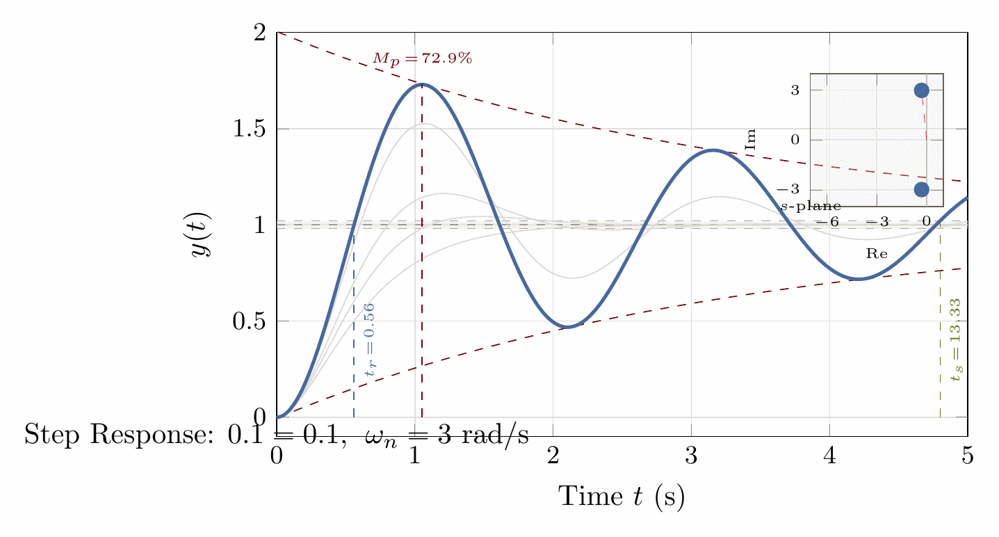 <b>29 Step Response</b></td>
<td align="center" width="25%"> <b>30 Wave Interference</b></td>
<td align="center" width="25%"> <b>31 Four-Bar Linkage</b></td>
</tr>
</table>
