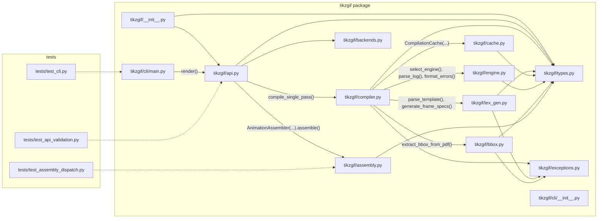

# Python File Interaction Diagram

This diagram shows how the real Python files in this repo interact.

- Solid arrows represent direct imports.
- Labels on some arrows show key runtime calls.
- Dashed arrows from tests indicate test-only dependencies.
- macOS metadata files like `._*.py` are excluded.

## Main Runtime Path

`tikzgif/cli/main.py` -> `tikzgif/api.py` -> `tikzgif/compiler.py` -> (`tikzgif/tex_gen.py`, `tikzgif/cache.py`, `tikzgif/engine.py`, `tikzgif/bbox.py`) -> back to `tikzgif/api.py` -> `tikzgif/backends.py` (PDF to PNG) -> `tikzgif/assembly.py` (GIF/MP4 output).
