# tikzgif

**Turn any parameterized TikZ drawing into a publication-quality animated GIF, MP4, WebP, or APNG -- in one command.**

tikzgif compiles each frame in parallel, detects bounding boxes automatically, caches results for instant re-renders, and supports every major LaTeX engine. Write your TikZ exactly the way you already do; just replace the value you want to animate with `\PARAM`.

```bash
pip install tikzgif
tikzgif render bouncing_ball.tex --frames 60 --fps 30 -o bouncing_ball.gif
```

<p align="center">
  
  &nbsp;&nbsp;
  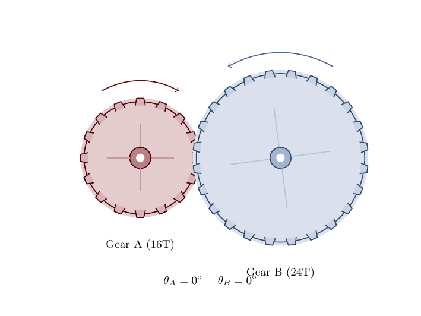
</p>

---

## Why tikzgif?

| | **tikzgif** | TikZ2animation |
|---|---|---|
| Automation | Fully automated pipeline -- one command from `.tex` to `.gif` | Manual shell script; user runs `pdflatex`, then `convert` separately |
| Parallelism | Compiles frames across all CPU cores simultaneously | Sequential compilation only |
| Output formats | GIF, MP4 (H.264/H.265), WebP, APNG, SVG, spritesheet, animated PDF | GIF only |
| LaTeX engines | pdflatex, xelatex, lualatex (auto-detected) | pdflatex only |
| Bounding boxes | Automatic two-pass detection; no clipping | Manual; user must configure `externalize` prefix |
| Caching | Content-addressable SHA-256 cache; unchanged frames are never recompiled | None |
| Error handling | Abort, skip, or retry policies per frame | Script halts on first error |
| Quality control | DPI presets (web/presentation/print), dithering algorithms, color quantization | Fixed `convert` flags |
| Template system | Built-in template registry with metadata, scaffolding, and preview | Single template file |
| Parameterization | Drop-in `\PARAM` token -- zero boilerplate | Requires `\foreach` loop, externalize library, shell-escape, manual file naming |
| Examples | 15 ready-to-run examples spanning physics, math, CS, and engineering | 5 examples |
| Testing | Full test suite with CI (lint, type-check, unit, integration) | None |
| Installation | `pip install tikzgif` | Clone repo + install ImageMagick |

---

## Gallery

Every GIF below was generated from a single `.tex` file using tikzgif.

### Physics & Engineering

<table>
<tr>
<td align="center" width="33%">
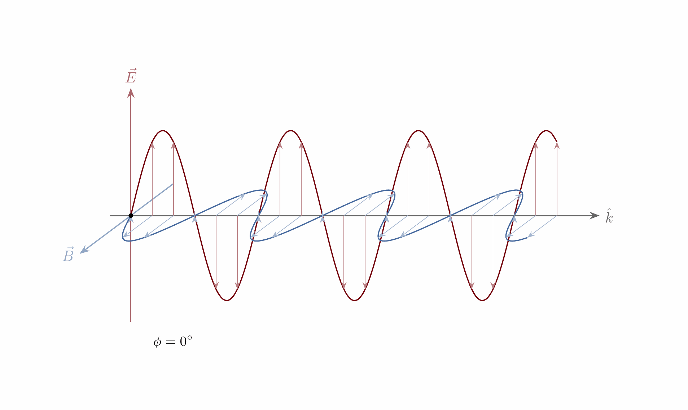<br/>
<b>EM Wave Propagation</b><br/>
<sub>3D E-field and B-field vectors</sub>
</td>
<td align="center" width="33%">
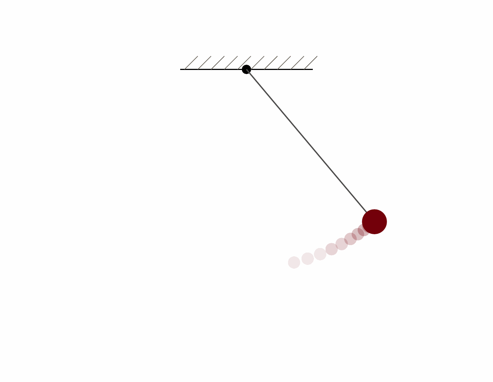<br/>
<b>Simple Pendulum</b><br/>
<sub>Swinging motion with fading trail</sub>
</td>
<td align="center" width="33%">
<br/>
<b>Meshing Gear Train</b><br/>
<sub>16T / 24T gears with realistic teeth</sub>
</td>
</tr>
<tr>
<td align="center" width="33%">
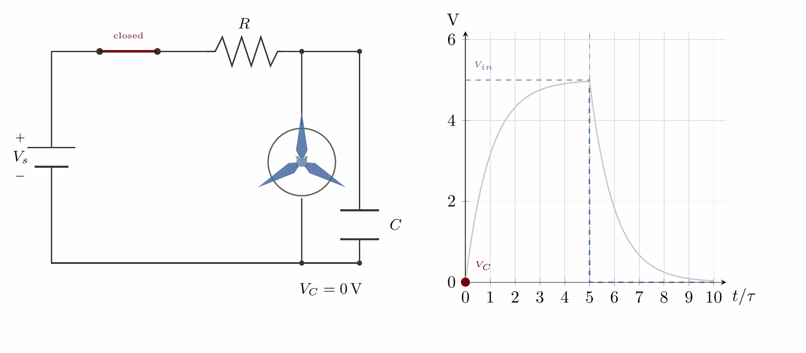<br/>
<b>RC Circuit Charging</b><br/>
<sub>Exponential voltage rise with live plot</sub>
</td>
<td align="center" width="33%">
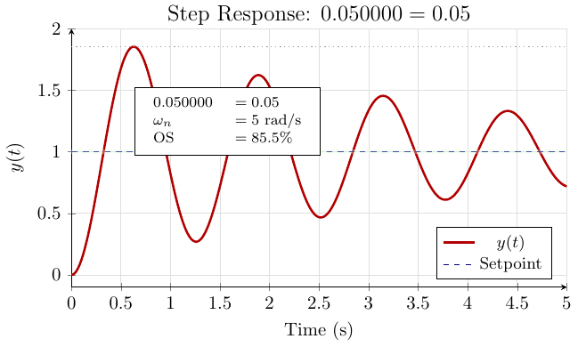<br/>
<b>Control Step Response</b><br/>
<sub>Second-order underdamped system</sub>
</td>
<td align="center" width="33%">
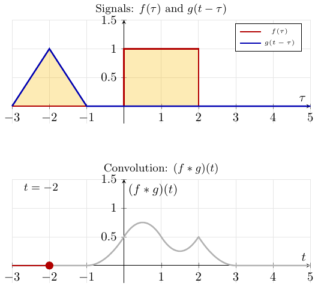<br/>
<b>Signal Convolution</b><br/>
<sub>Sliding-window integral visualization</sub>
</td>
</tr>
</table>

### Mathematics & Computer Science

<table>
<tr>
<td align="center" width="33%">
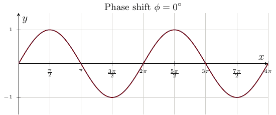<br/>
<b>Sine Wave Phase Shift</b><br/>
<sub>pgfplots with animated phase</sub>
</td>
<td align="center" width="33%">
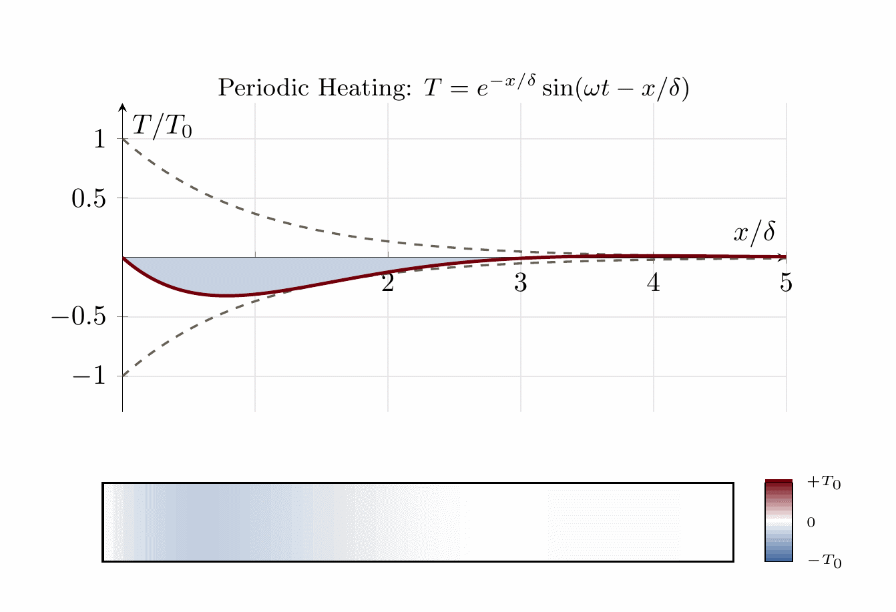<br/>
<b>1D Heat Equation</b><br/>
<sub>Color-coded temperature diffusion</sub>
</td>
<td align="center" width="33%">
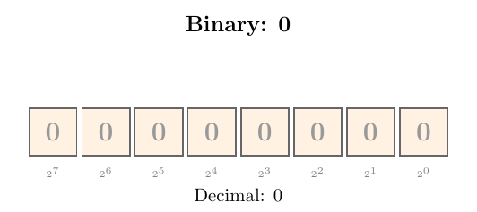<br/>
<b>8-Bit Binary Counter</b><br/>
<sub>Visual bit representation 0--255</sub>
</td>
</tr>
<tr>
<td align="center" width="33%">
<br/>
<b>Bubble Sort</b><br/>
<sub>Algorithm step-through</sub>
</td>
<td align="center" width="33%">
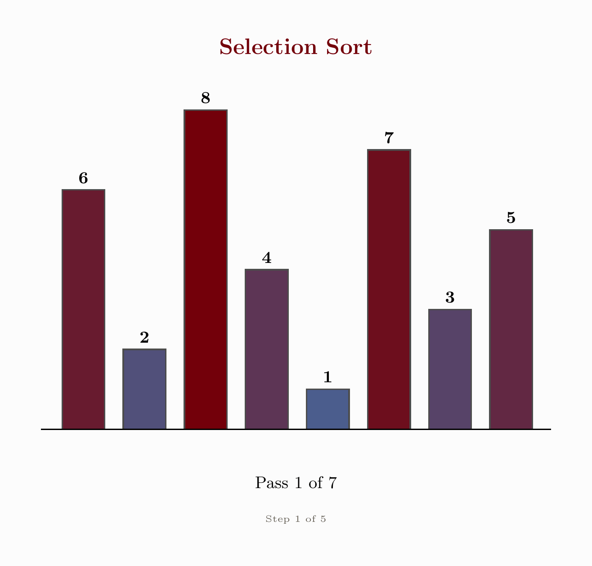<br/>
<b>Selection Sort</b><br/>
<sub>Algorithm step-through</sub>
</td>
<td align="center" width="33%">
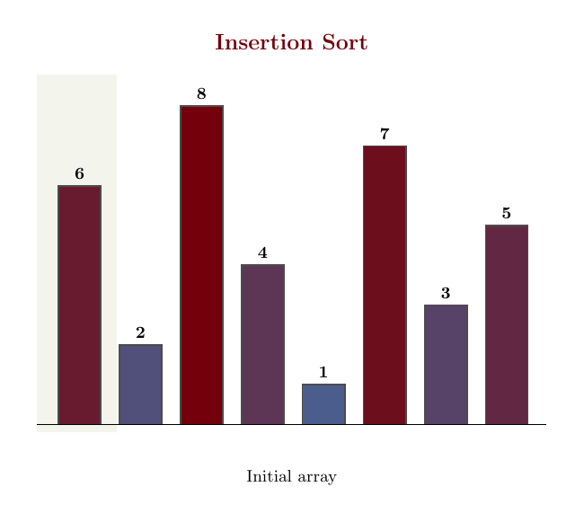<br/>
<b>Insertion Sort</b><br/>
<sub>Algorithm step-through</sub>
</td>
</tr>
</table>

### Dynamics & Fractals

<table>
<tr>
<td align="center" width="33%">
<br/>
<b>Bouncing Ball</b><br/>
<sub>Parabolic trajectory with trail</sub>
</td>
<td align="center" width="33%">
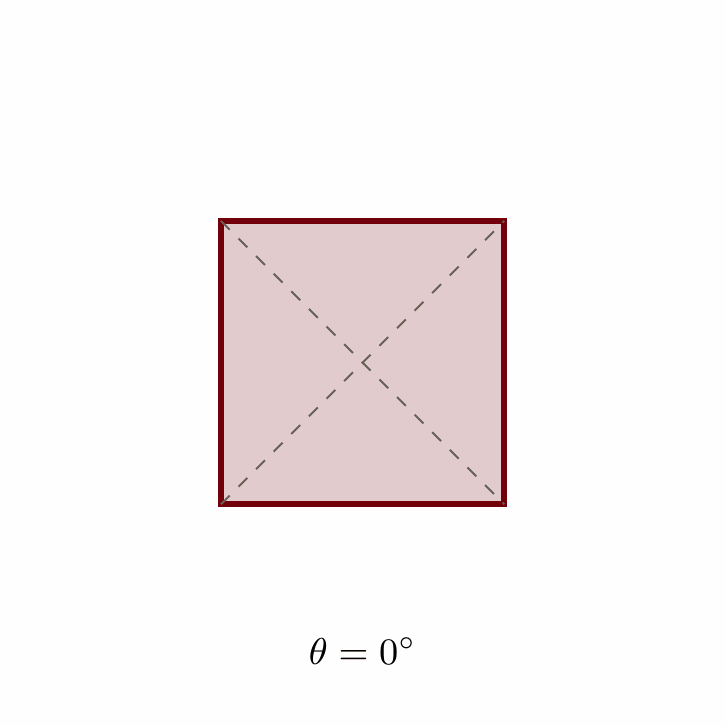<br/>
<b>Rotating Square</b><br/>
<sub>Minimal getting-started example</sub>
</td>
<td align="center" width="33%">
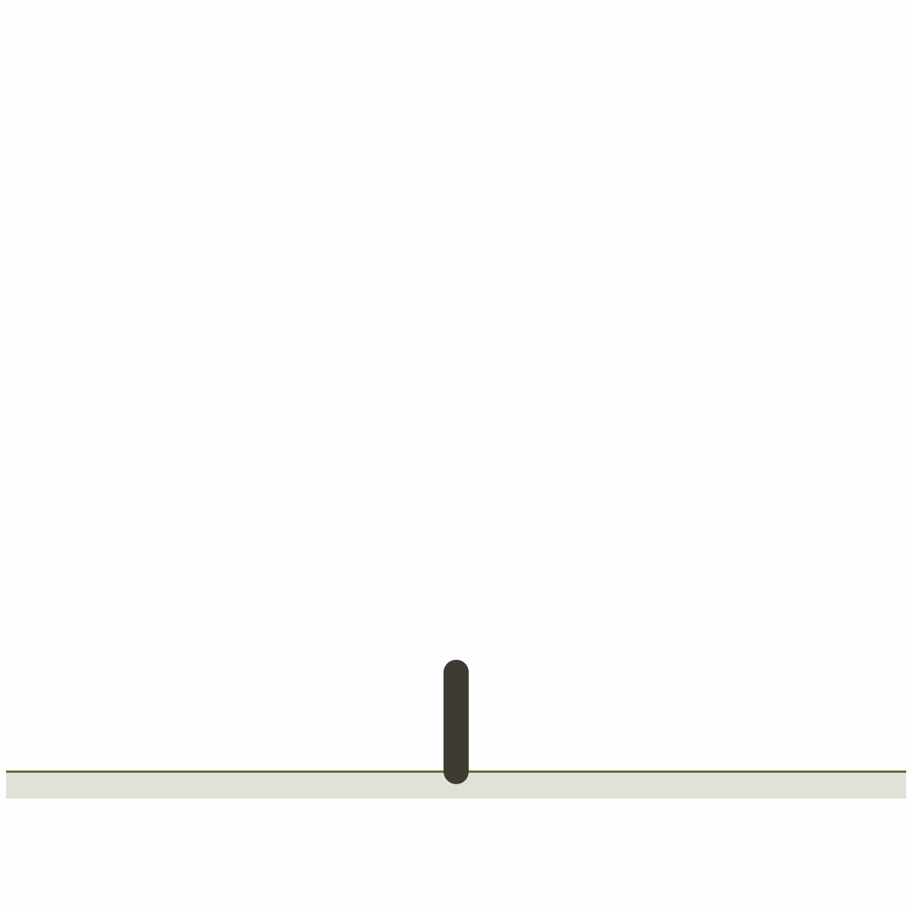<br/>
<b>Fractal Tree Growth</b><br/>
<sub>Recursive branching with foliage</sub>
</td>
</tr>
</table>

---

## How It Works

```
┌──────────────┐     ┌──────────────┐     ┌──────────────┐     ┌──────────────┐
│  .tex file   │────▶│  Frame Gen   │────▶│   Parallel   │────▶│   Assembly   │
│  with \PARAM │     │  N copies    │     │   Compile    │     │  GIF / MP4   │
└──────────────┘     └──────────────┘     └──────────────┘     └──────────────┘
                           │                     │                     │
                     Replace \PARAM        pdflatex/xelatex      Pillow / ffmpeg
                     with frame value      lualatex workers      gifsicle / etc.
```

1. **Parse** -- tikzgif reads your `.tex` file, finds every `\PARAM` token, and detects which packages/engine you need.
2. **Generate** -- It produces N standalone `.tex` files, each with `\PARAM` replaced by a linearly interpolated value from your specified range.
3. **Compile** -- All frames compile in parallel using a `ProcessPoolExecutor`. Each frame runs in an isolated directory to prevent auxiliary-file collisions. A content-addressable cache (SHA-256) skips frames that haven't changed.
4. **Bounding box** -- A two-pass probe (frames 0, N/4, N/2, 3N/4) computes the union bounding box so every frame has identical dimensions -- no jitter.
5. **Assemble** -- Rendered PDFs are converted to PNGs (via pdf2image, PyMuPDF, or Ghostscript), then stitched into the output format of your choice.

---

## Quick Start

### Prerequisites

- Python 3.10+
- A LaTeX distribution (`texlive`, `miktex`, or `mactex`) with `pdflatex`
- (Optional) `ffmpeg` for MP4 output, `gifsicle` for optimized GIFs

### Install

```bash
pip install tikzgif
```

### Write a template

Any TikZ file works. Replace the value you want to animate with `\PARAM`:

```latex
\documentclass[tikz]{standalone}
\begin{document}
\begin{tikzpicture}
  \fill[red] (0,0) rectangle (\PARAM, \PARAM);
\end{tikzpicture}
\end{document}
```

### Render

```bash
# Basic GIF (30 frames, default 10 fps)
tikzgif render growing_square.tex --frames 30 -o growing_square.gif

# MP4 at presentation quality
tikzgif render growing_square.tex --frames 60 --fps 30 --format mp4 --quality presentation

# Preview a single frame without rendering the full animation
tikzgif templates preview growing_square --param t=0.5
```

---

## Template Syntax

The only requirement is that your `.tex` file contains the `\PARAM` token. tikzgif replaces it with a linearly interpolated value for each frame.

```latex
% Example: Bouncing Ball (excerpt)
\pgfmathsetmacro{\xpos}{\PARAM * 10}
\pgfmathsetmacro{\tlocal}{2*\PARAM - floor(2*\PARAM)}
\pgfmathsetmacro{\ypos}{4 * 4 * \tlocal * (1 - \tlocal)}
\fill[garnet] (\xpos, \ypos) circle (0.35);
```

Optional metadata can be embedded directly in the `.tex` file:

```latex
% Parameter: \PARAM (time in range 0..1)
% Range: 0 to 1, recommended 60 frames
% Difficulty: beginner
% Features demonstrated: mathematical expressions, shadows, trail effect
```

---

## CLI Reference

```
tikzgif [--version] COMMAND [OPTIONS]

Commands:
  render              Render a .tex file into an animation
  templates list      List built-in templates (filterable by domain)
  templates preview   Render a single static frame for inspection
  templates render    Render a built-in template with custom parameters
  templates new       Scaffold a new template with metadata
  templates export    Export a single frame as standalone .tex

Common flags:
  --frames N          Number of animation frames (default: 30)
  --fps N             Frames per second (default: 10)
  --format FORMAT     gif | mp4 | webp | apng | svg | spritesheet | pdf
  --quality PRESET    web (96 DPI) | presentation (150 DPI) | print (300 DPI)
  --engine ENGINE     pdflatex | xelatex | lualatex (auto-detected)
  --workers N         Parallel compilation workers (default: cpu_count - 1)
  --dither ALG        floyd_steinberg | ordered | none
  --error-policy P    abort | skip | retry
  -o, --output FILE   Output filename
```

---

## Output Formats

| Format | Backend | Best for |
|---|---|---|
| GIF | Pillow / ImageMagick / gifsicle | Presentations, GitHub READMEs, Slack |
| MP4 | ffmpeg (H.264 / H.265) | High-quality video, large frame counts |
| WebP | Pillow | Web embedding, smaller file size than GIF |
| APNG | Pillow | Transparency + animation in browsers |
| SVG | cairosvg | Vector-quality web animations |
| Spritesheet | Pillow | CSS/JS-driven web animations |
| Animated PDF | LaTeX beamer | Presentations within LaTeX workflows |

---

## Architecture

tikzgif is a modular pipeline with clearly separated stages:

```
Entry Point → Config Resolver → Template Engine → Cache Lookup
    → Bbox Pre-Pass → Parallel Compiler → Frame Extraction
    → Image Processor → Assembly Engine → Output
```

| Module | Responsibility |
|---|---|
| `tex_gen.py` | Parse templates, detect packages, generate per-frame `.tex` |
| `compiler.py` | Parallel `ProcessPoolExecutor` with isolated working dirs |
| `cache.py` | SHA-256 content-addressable frame cache |
| `bbox.py` | Two-pass bounding box probe and union |
| `backends.py` | PDF-to-PNG conversion (pdf2image, PyMuPDF, Ghostscript) |
| `processing.py` | Canvas uniforming, quantization, dithering |
| `assembly.py` | Final GIF/MP4/WebP/APNG/SVG assembly |
| `engine.py` | LaTeX engine detection and auto-selection |

Full module source is in the `tikzgif/` package directory.

---

## Configuration

Settings are resolved in order of precedence (lowest to highest):

1. Hardcoded defaults
2. `~/.config/tikzgif/config.toml` (user global)
3. `./tikzgif.toml` (project local)
4. Metadata block in `.tex` file
5. CLI flags

---

## Development

```bash
git clone https://github.com/j-vaught/tikzgif.git
cd tikzgif
pip install -e ".[dev]"

# Run the full test suite
pytest

# Lint and type-check
ruff check tikzgif tests
mypy tikzgif

# Run only fast unit tests (no LaTeX required)
pytest -m "not integration and not slow"
```

The test suite includes unit tests, integration tests (require LaTeX), gallery smoke tests for all 15 examples, edge-case coverage, and performance benchmarks.

---

## License

MIT
