# tikzgif

Convert a parameterized TikZ/LaTeX file into an animation from one command.

`tikzgif` compiles frames in parallel and renders to GIF or MP4.

## Quick Examples

<p align="center">
  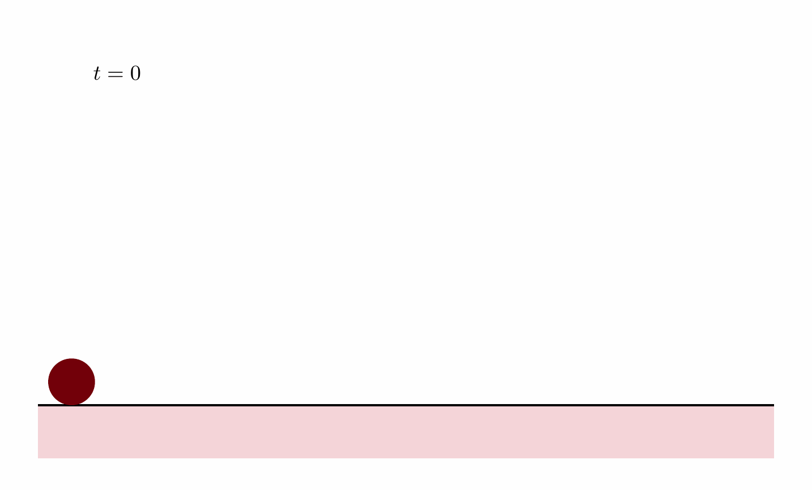
  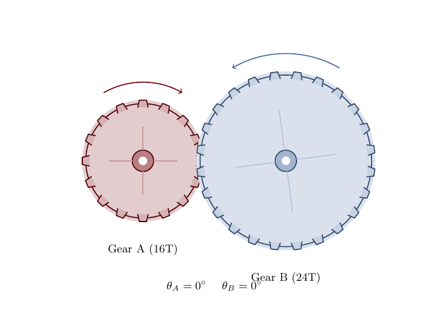
</p>
<p align="center">
  
  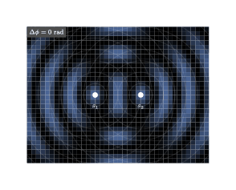
</p>

## Why tikzgif?

| | **tikzgif** | [TikZ2animation](https://github.com/heschmann/TikZ2animation) |
|---|---|---|
| Automation | One command from `.tex` to animation output | Manual script workflow |
| Parallelism | Frame compilation across CPU cores | Sequential compilation |
| Output formats | GIF, MP4 | GIF only |
| LaTeX engines | `pdflatex`, `xelatex`, `lualatex` | `pdflatex` only |
| Caching | Content-addressable cache for unchanged frames | None |
| Installation | Install from source (`pip install -e .`) | Clone repo + ImageMagick setup |

## Install (from source)

```bash
git clone https://github.com/j-vaught/tikzgif.git
cd tikzgif
python3 -m venv .venv
source .venv/bin/activate
pip install -e .
```

## Basic Usage

1. Put `\PARAM` where you want the animated value.
2. Render frames by sweeping a range.

```bash
tikzgif render examples/02_bouncing_ball.tex \
  --frames 60 \
  --start 0 \
  --end 1 \
  --fps 30 \
  -o outputs/bouncing_ball.gif
```

## More GIF Examples

See [EXAMPLES.md](EXAMPLES.md) for the full gallery.

<table>
<tr>
<td align="center" width="25%">
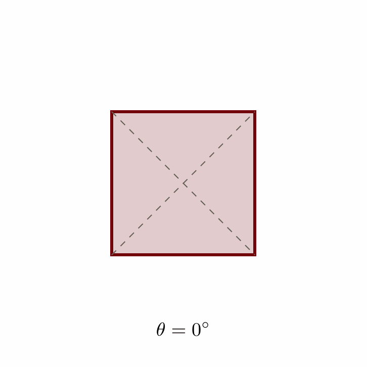<br/>
<b>Rotating Square</b>
</td>
<td align="center" width="25%">
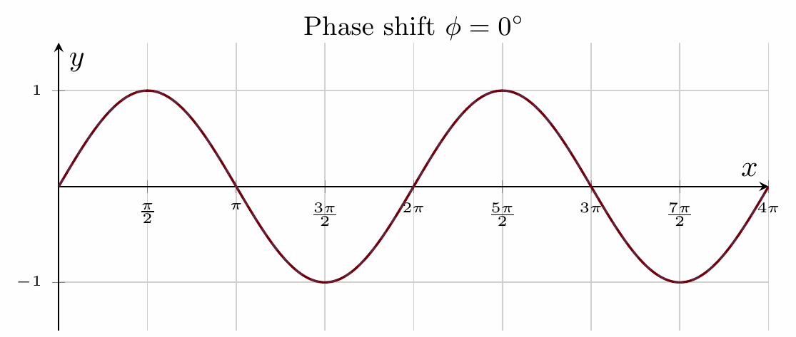<br/>
<b>Sine Wave Phase</b>
</td>
<td align="center" width="25%">
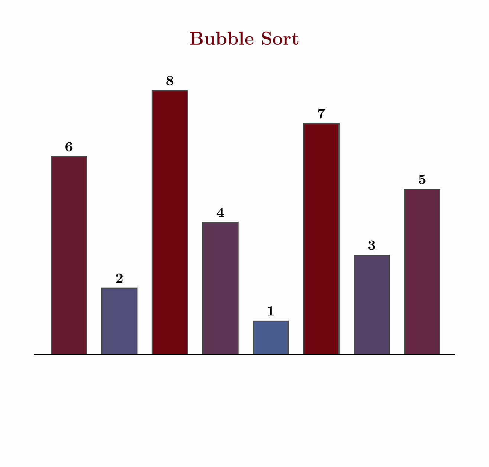<br/>
<b>Bubble Sort</b>
</td>
<td align="center" width="25%">
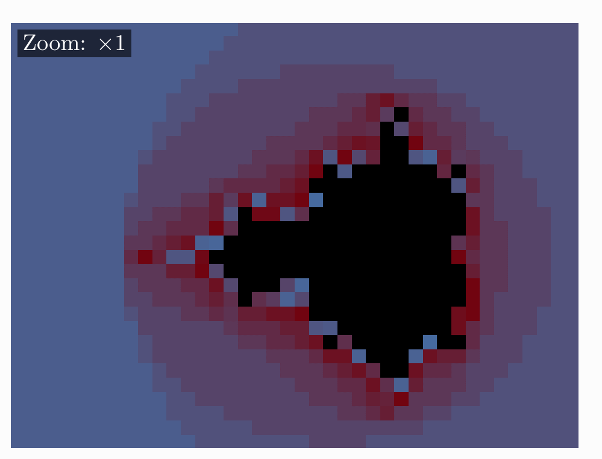<br/>
<b>Mandelbrot Zoom</b>
</td>
</tr>
<tr>
<td align="center" width="25%">
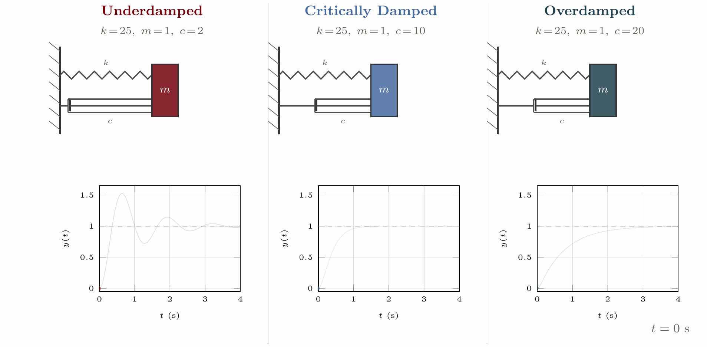<br/>
<b>Step Response</b>
</td>
<td align="center" width="25%">
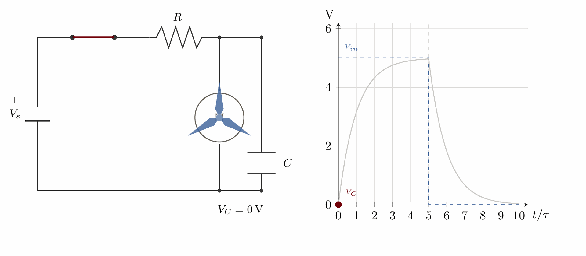<br/>
<b>RC Circuit</b>
</td>
<td align="center" width="25%">
<br/>
<b>Pendulum</b>
</td>
<td align="center" width="25%">
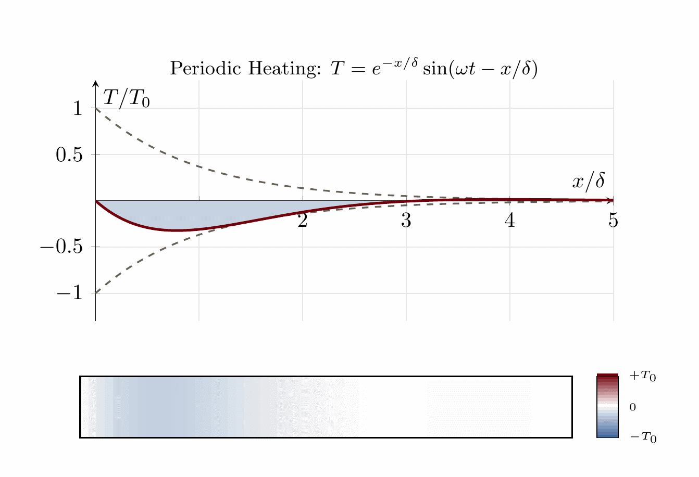<br/>
<b>Heat Equation</b>
</td>
</tr>
<tr>
<td align="center" width="25%">
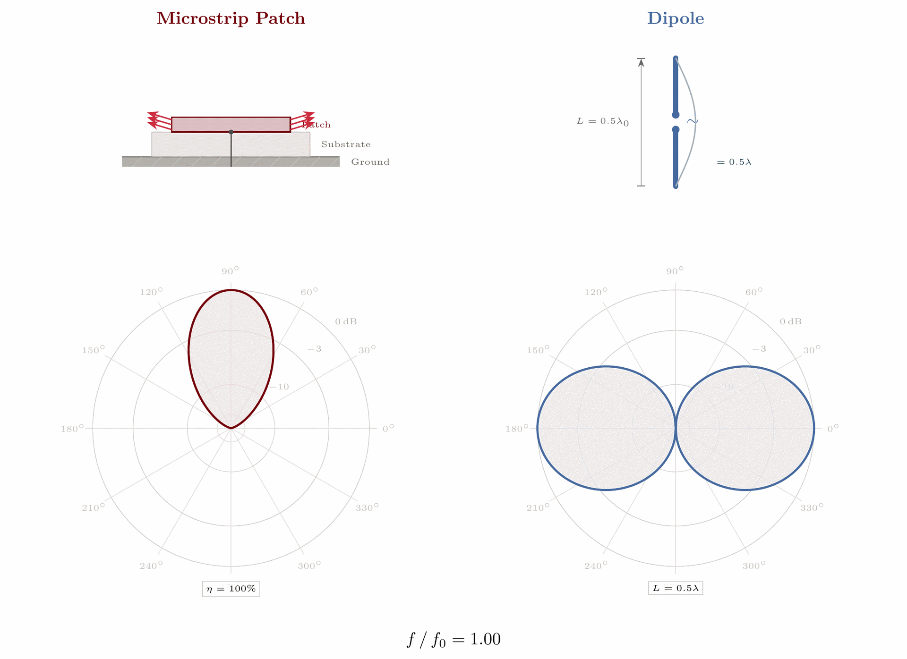<br/>
<b>Antenna Radiation</b>
</td>
<td align="center" width="25%">
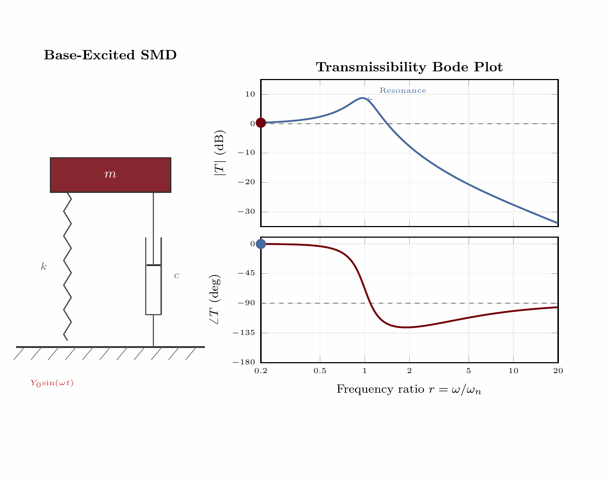<br/>
<b>Bode Plot</b>
</td>
<td align="center" width="25%">
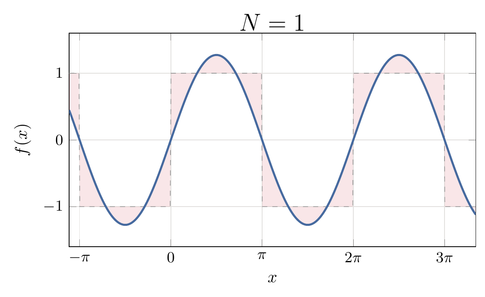<br/>
<b>Fourier Series</b>
</td>
<td align="center" width="25%">
<br/>
<b>Four-Bar Linkage</b>
</td>
</tr>
</table>

## Minimal TikZ Pattern

```tex
% Use \PARAM anywhere you want the animated value
\\draw[thick] (0,0) circle ({0.5 + 0.2*\\PARAM});
```

## Common Output Targets

- GIF for docs and slides.
- MP4 for video workflows.

## Requirements

- A LaTeX engine available on `PATH` (`pdflatex`, `xelatex`, or `lualatex`).
- Python 3.10+.
- `pdftoppm` from poppler-utils for PDF to PNG conversion.
- `ffmpeg` only when writing MP4 output.
