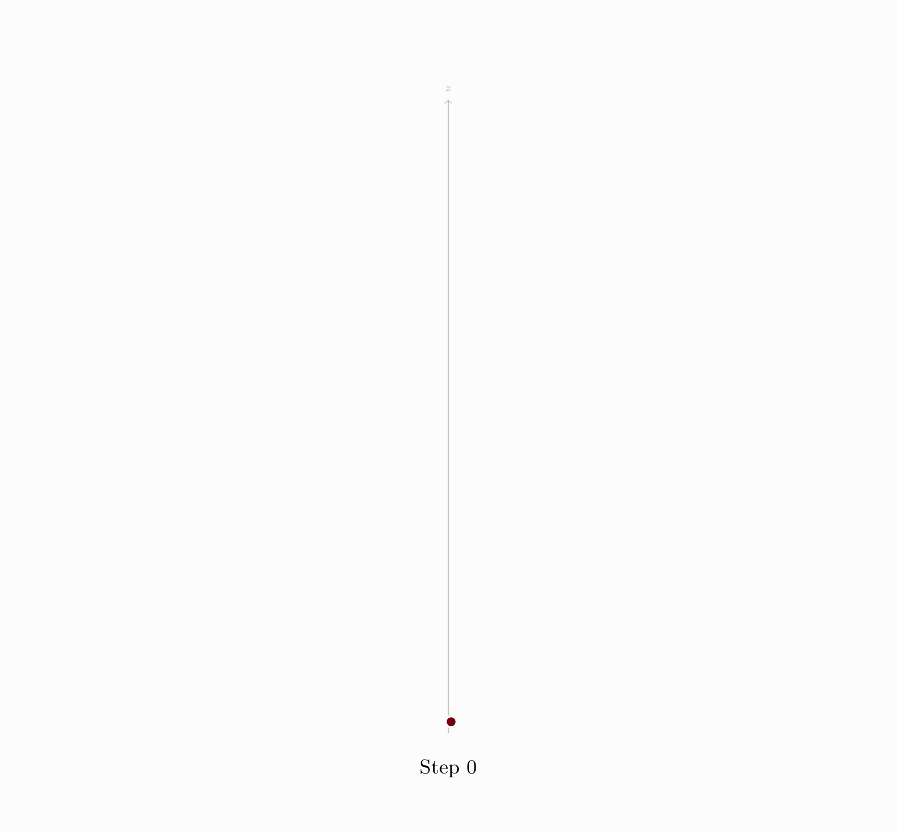
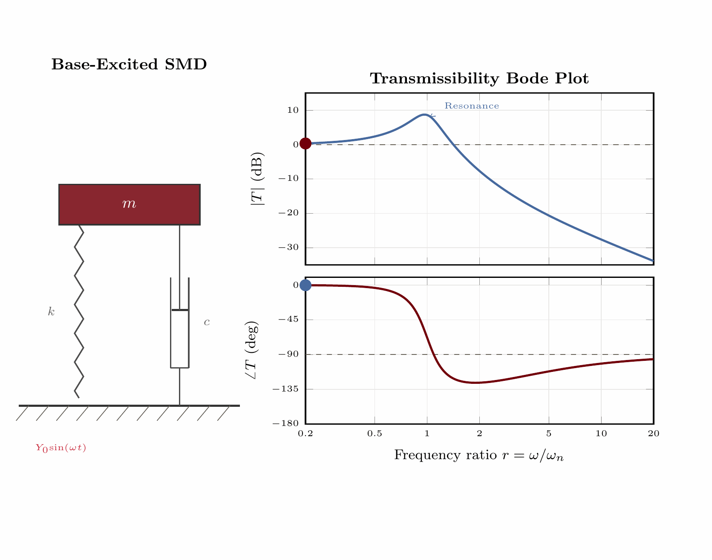
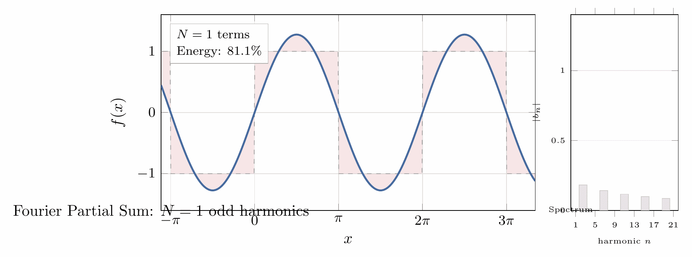
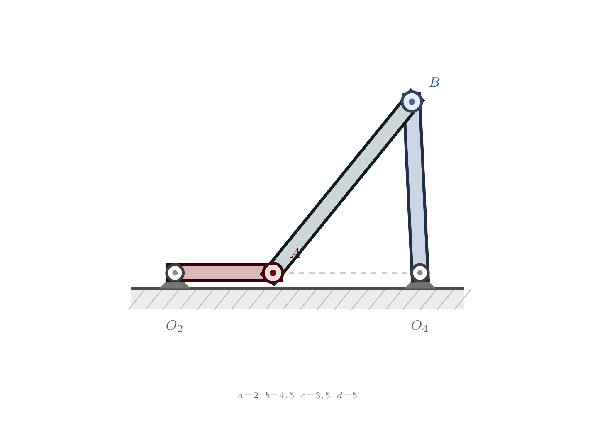

# From Static TikZ to Living Diagrams: Why I Built tikzgif

## 1. The Moment I Got Tired of Screenshot Workflows

I spent years making technical visuals in TikZ for lectures, reports, and demos. The drawings looked great as static figures, but the moment I wanted motion, everything broke down into a manual pipeline: tweak a parameter, compile, export, crop, repeat, stitch, tune quality, then start over if I noticed a mistake. It worked, but it felt like fighting tooling instead of building ideas.

The turning point came when I was iterating on control systems and electromagnetics visuals. I had dozens of near-identical frames and no clean way to regenerate them when I changed a style or formula. I wanted one source of truth, one command, and outputs that looked publication-ready without manual babysitting.

That frustration became this project: `tikzgif`, a pipeline that takes a parameterized `.tex` file and renders animation formats like GIF, MP4, WebP, and APNG with sane defaults, parallel frame compilation, and reproducible outputs.


The promise I wanted for myself was simple: if I can draw it in TikZ, I should be able to animate it without inventing a new workflow each time.

## 2. What Was Broken in My Old Process

Before this repo, my animation loop usually looked like this:

1. Hand-edit parameter values in TeX.
2. Run LaTeX repeatedly.
3. Convert PDFs to PNGs with ad hoc commands.
4. Stitch images with ImageMagick flags I had to keep rediscovering.
5. Re-run everything when the bounding box shifted or one frame failed.

The core issue was not “LaTeX is slow.” The issue was **coordination overhead**. Every stage had separate failure modes and separate tooling assumptions.

- If two frames had slightly different extents, the final animation jittered.
- If one frame failed late, I often re-ran too much work.
- If I switched machines, I had to remember toolchain differences again.
- If I changed one line in the template, I still paid near-full compile cost.

I wanted to keep TikZ itself as the authoring interface, but automate everything around it: frame generation, compilation strategy, caching, conversion, and assembly.

## 3. The Design Target: One Command, Many Outputs

The design goal for `tikzgif` was strict: **I should be able to hand someone a single `.tex` file and one CLI command, and they should get a usable animation artifact**.

That sounds obvious, but it forced a lot of early decisions:

- Keep parameterization dead simple (`\PARAM` token by default).
- Make frame compilation parallel by default.
- Normalize frame extents so output is stable.
- Support more than GIF from day one.
- Auto-detect toolchains and degrade gracefully where possible.

I intentionally did not build a new drawing DSL or ask people to abandon TikZ habits. If you already know how to author diagrams in TeX, this should feel like adding one small convention, not adopting a new ecosystem.


## 4. How the Pipeline Actually Runs

At a high level, `tikzgif` turns one parameterized source into an ordered list of frame results, then assembles them.

1. Parse template and detect package/tool requirements.
2. Generate frame specs by replacing the parameter token with interpolated values.
3. Compile frames in parallel in isolated directories.
4. Estimate a stable bounding envelope and normalize output extents.
5. Convert resulting PDFs to images through the best available backend.
6. Assemble target format (GIF/MP4/WebP/APNG/SVG/spritesheet/PDF animation).

The pipeline boundary choices mattered more than any individual trick. Keeping stages explicit made it easier to reason about failure handling (`abort`, `skip`, `retry`) and easier to test each part independently.

I also leaned into deterministic structure where possible: frame index ordering, content hashing, and predictable naming all make debugging far less painful than shell-script style glue.

## 5. Outputs Along the Way, Not Just at the End

One important shift in this repo is that I stopped treating animation as a single opaque output step. I now think in intermediate products:

- **Template source**: the human-readable truth.
- **Per-frame TeX**: generated, explicit, inspectable.
- **Per-frame PDF**: compilation artifact with good debugging value.
- **Per-frame image**: rendering artifact before final encoding.
- **Final animation**: format-specific artifact tuned for destination.

That separation made debugging dramatically easier. If something looks wrong, I can ask: was the math wrong in TeX, did compilation fail, did conversion alter color/alpha, or did assembly quantization introduce artifacts?

These are some of the outputs that made me confident the pipeline was doing the right thing across domains:







For me, this was a major design lesson: the easiest systems to trust are the ones where each stage has visible artifacts and crisp boundaries.

## 6. Engine Decisions: `pdflatex`, `xelatex`, or `lualatex`

Engine support was non-negotiable because TikZ users do not all live in the same TeX world.

- `pdflatex` is usually the fastest default for pure TikZ and pgfplots workflows.
- `xelatex` and `lualatex` are necessary when templates depend on Unicode/font packages like `fontspec`.
- Some packages effectively force LuaLaTeX (`luacode`, `luatexbase`, `tikz-feynman`).

The engine resolver in `tikzgif/engine.py` follows this pattern:

```python
unicode_packages = {"fontspec", "unicode-math", "luacode", "luatexbase"}
lua_only = {"luacode", "luatexbase", "tikz-feynman"}

if needs_lua:
    return LatexEngine.LUALATEX
if needs_unicode:
    return LatexEngine.XELATEX or LatexEngine.LUALATEX
return LatexEngine.PDFLATEX
```

That choice avoids an annoying class of user errors where “the tool works for some templates but silently breaks on others.” If a package implies an engine constraint, I want the tool to honor that explicitly.

This is also why I kept manual override support: auto-selection should be smart, not authoritarian.

## 7. Backend and Format Tradeoffs

Compilation engines produce PDFs, but final delivery depends on conversion and assembly backends. I wanted this layer to be pluggable because real environments vary.

Current conversion priority in `tikzgif/backends.py` is:

```python
BACKEND_PRIORITY = [
    PdftoppmBackend,
    PyMuPDFBackend,
    Pdf2ImageBackend,
    GhostscriptBackend,
    ImageMagickBackend,
]
```

That order reflects practical experience: if `pdftoppm` is installed, it is usually the fastest and most predictable option for high-volume frame conversion. If not, the pipeline keeps going with the best available fallback.

Then assembly (`tikzgif/assembly.py`) targets multiple destinations:

- GIF for docs, slides, and social previews.
- MP4 for cleaner quality at larger frame counts.
- WebP/APNG for modern browser-friendly animation.
- SVG/spritesheet/PDF-animate for specialized workflows.

I try to treat format choice as a product decision, not a codec religion problem. If the artifact is going to GitHub, GIF is often enough. If it is going into a talk deck or a polished demo, MP4/WebP usually wins on quality-per-byte.


## 8. Why It Feels Fast: Parallelism, Caching, and Stable Bounds

Three design decisions changed this project from “useful script” to “daily tool.”

### Parallel compilation

Frames compile with a process pool so work scales with available CPU cores. This is not an optimization garnish; it is the baseline strategy for anything beyond toy animations.

```python
with ProcessPoolExecutor(max_workers=workers) as ex:
    futures = [ex.submit(_compile_single_frame, ... ) for spec in to_compile]
```

### Content-addressable cache

Each frame source gets a SHA-256 hash. If the generated content for a frame did not change, I skip recompilation and reuse cached artifacts. That makes iterative style edits and partial reruns dramatically cheaper.

### Bounding-box normalization

A small per-frame extent change causes visible jitter in animations. The two-pass envelope strategy probes representative frames, unions bounds, and applies a consistent canvas envelope.

```python
# Probe subset, union all bboxes, then normalize every frame to envelope.
envelope = compute_envelope(probe_boxes).padded(config.bbox_padding_bp)
```

This trio is the difference between “I can render this once” and “I can iterate creatively without dreading reruns.”



## 9. A Light Benchmark Snapshot (Measured Locally)

I ran a small benchmark pass on **February 8, 2026** in this repo to ground performance claims in numbers instead of vibes. These are not universal benchmarks, but they are useful directional data.

### Single-frame compile timings from `tests/benchmarks/test_benchmarks.py`

| Template tier | Measured compile time | PDF size |
|---|---:|---:|
| Simple | 0.205 s | 17,820 B |
| Medium | 0.694 s | 38,233 B |
| Heavy | 2.257 s | 65,581 B |

### Engine comparison on `examples/01_rotating_square.tex` (3-run average)

| Engine | Avg compile time |
|---|---:|
| `pdflatex` | 0.240 s |
| `xelatex` | 0.256 s |
| `lualatex` | 0.542 s |

Interpretation:

- For simple TikZ-only cases, `pdflatex` remained the fastest in this environment.
- `xelatex` was close enough that feature requirements (fonts/Unicode) should drive the decision more than tiny speed differences.
- `lualatex` was slower here, but it is still the correct engine when a template requires Lua-side capabilities.

I treat these numbers as “planning-grade” and not a formal benchmark paper. The useful takeaway is relative behavior, not absolute milliseconds.
