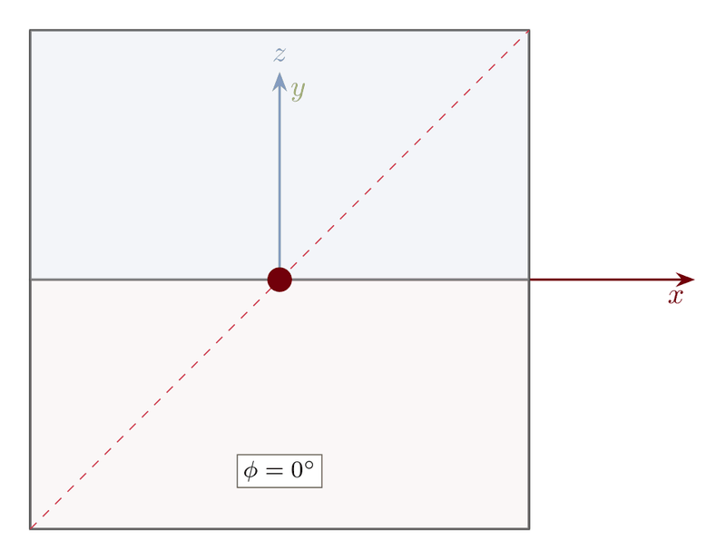
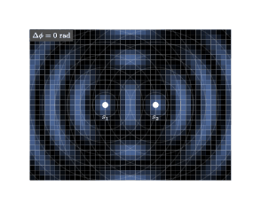

# From Static TikZ to Living Diagrams: Why I Built tikzgif

## 1. The Moment I Got Tired of Screenshot Workflows

I spent years making technical visuals in TikZ for lectures, reports, and demos. The drawings looked great as static figures, but the moment I wanted motion, everything broke down into a manual pipeline: tweak a parameter, compile, export, crop, repeat, stitch, tune quality, then start over if I noticed a mistake. It worked, but it felt like fighting tooling instead of building ideas.

The turning point came when I was iterating on control systems and electromagnetics visuals. I had dozens of near-identical frames and no clean way to regenerate them when I changed a style or formula. I wanted one source of truth, one command, and outputs that looked publication-ready without manual babysitting.

That frustration became this project: `tikzgif`, a pipeline that takes a parameterized `.tex` file and renders animation formats like GIF, MP4, WebP, and APNG with sane defaults, parallel frame compilation, and reproducible outputs.


The promise I wanted for myself was simple: if I can draw it in TikZ, I should be able to animate it without inventing a new workflow each time.

## 2. What Was Broken in My Old Process

Before this repo, my animation loop usually looked like this:

1. Hand-edit parameter values in TeX.
2. Run LaTeX repeatedly.
3. Convert PDFs to PNGs with ad hoc commands.
4. Stitch images with ImageMagick flags I had to keep rediscovering.
5. Re-run everything when the bounding box shifted or one frame failed.

The core issue was not “LaTeX is slow.” The issue was **coordination overhead**. Every stage had separate failure modes and separate tooling assumptions.

- If two frames had slightly different extents, the final animation jittered.
- If one frame failed late, I often re-ran too much work.
- If I switched machines, I had to remember toolchain differences again.
- If I changed one line in the template, I still paid near-full compile cost.

I wanted to keep TikZ itself as the authoring interface, but automate everything around it: frame generation, compilation strategy, caching, conversion, and assembly.

## 3. The Design Target: One Command, Many Outputs

The design goal for `tikzgif` was strict: **I should be able to hand someone a single `.tex` file and one CLI command, and they should get a usable animation artifact**.

That sounds obvious, but it forced a lot of early decisions:

- Keep parameterization dead simple (`\PARAM` token by default).
- Make frame compilation parallel by default.
- Normalize frame extents so output is stable.
- Support more than GIF from day one.
- Auto-detect toolchains and degrade gracefully where possible.

I intentionally did not build a new drawing DSL or ask people to abandon TikZ habits. If you already know how to author diagrams in TeX, this should feel like adding one small convention, not adopting a new ecosystem.


## 4. How the Pipeline Actually Runs

At a high level, `tikzgif` turns one parameterized source into an ordered list of frame results, then assembles them.

1. Parse template and detect package/tool requirements.
2. Generate frame specs by replacing the parameter token with interpolated values.
3. Compile frames in parallel in isolated directories.
4. Estimate a stable bounding envelope and normalize output extents.
5. Convert resulting PDFs to images through the best available backend.
6. Assemble target format (GIF/MP4/WebP/APNG/SVG/spritesheet/PDF animation).

The pipeline boundary choices mattered more than any individual trick. Keeping stages explicit made it easier to reason about failure handling (`abort`, `skip`, `retry`) and easier to test each part independently.

I also leaned into deterministic structure where possible: frame index ordering, content hashing, and predictable naming all make debugging far less painful than shell-script style glue.

## 5. Outputs Along the Way, Not Just at the End

One important shift in this repo is that I stopped treating animation as a single opaque output step. I now think in intermediate products:

- **Template source**: the human-readable truth.
- **Per-frame TeX**: generated, explicit, inspectable.
- **Per-frame PDF**: compilation artifact with good debugging value.
- **Per-frame image**: rendering artifact before final encoding.
- **Final animation**: format-specific artifact tuned for destination.

That separation made debugging dramatically easier. If something looks wrong, I can ask: was the math wrong in TeX, did compilation fail, did conversion alter color/alpha, or did assembly quantization introduce artifacts?

These are some of the outputs that made me confident the pipeline was doing the right thing across domains:


For me, this was a major design lesson: the easiest systems to trust are the ones where each stage has visible artifacts and crisp boundaries.

## 6. Engine Decisions: `pdflatex`, `xelatex`, or `lualatex`

Engine support was non-negotiable because TikZ users do not all live in the same TeX world.

- `pdflatex` is usually the fastest default for pure TikZ and pgfplots workflows.
- `xelatex` and `lualatex` are necessary when templates depend on Unicode/font packages like `fontspec`.
- Some packages effectively force LuaLaTeX (`luacode`, `luatexbase`, `tikz-feynman`).

The engine resolver in `tikzgif/engine.py` follows this pattern:

```python
unicode_packages = {"fontspec", "unicode-math", "luacode", "luatexbase"}
lua_only = {"luacode", "luatexbase", "tikz-feynman"}

if needs_lua:
    return LatexEngine.LUALATEX
if needs_unicode:
    return LatexEngine.XELATEX or LatexEngine.LUALATEX
return LatexEngine.PDFLATEX
```

That choice avoids an annoying class of user errors where “the tool works for some templates but silently breaks on others.” If a package implies an engine constraint, I want the tool to honor that explicitly.

This is also why I kept manual override support: auto-selection should be smart, not authoritarian.

## 7. Backend and Format Tradeoffs

Compilation engines produce PDFs, but final delivery depends on conversion and assembly backends. I wanted this layer to be pluggable because real environments vary.

Current conversion priority in `tikzgif/backends.py` is:

```python
BACKEND_PRIORITY = [
    PdftoppmBackend,
    PyMuPDFBackend,
    Pdf2ImageBackend,
    GhostscriptBackend,
    ImageMagickBackend,
]
```

That order reflects practical experience: if `pdftoppm` is installed, it is usually the fastest and most predictable option for high-volume frame conversion. If not, the pipeline keeps going with the best available fallback.

Then assembly (`tikzgif/assembly.py`) targets multiple destinations:

- GIF for docs, slides, and social previews.
- MP4 for cleaner quality at larger frame counts.
- WebP/APNG for modern browser-friendly animation.
- SVG/spritesheet/PDF-animate for specialized workflows.

I try to treat format choice as a product decision, not a codec religion problem. If the artifact is going to GitHub, GIF is often enough. If it is going into a talk deck or a polished demo, MP4/WebP usually wins on quality-per-byte.


## 8. Why It Feels Fast: Parallelism, Caching, and Stable Bounds

Three design decisions changed this project from “useful script” to “daily tool.”

### Parallel compilation

Frames compile with a process pool so work scales with available CPU cores. This is not an optimization garnish; it is the baseline strategy for anything beyond toy animations.

```python
with ProcessPoolExecutor(max_workers=workers) as ex:
    futures = [ex.submit(_compile_single_frame, ... ) for spec in to_compile]
```

### Content-addressable cache

Each frame source gets a SHA-256 hash. If the generated content for a frame did not change, I skip recompilation and reuse cached artifacts. That makes iterative style edits and partial reruns dramatically cheaper.

### Bounding-box normalization

A small per-frame extent change causes visible jitter in animations. The two-pass envelope strategy probes representative frames, unions bounds, and applies a consistent canvas envelope.

```python
# Probe subset, union all bboxes, then normalize every frame to envelope.
envelope = compute_envelope(probe_boxes).padded(config.bbox_padding_bp)
```

This trio is the difference between “I can render this once” and “I can iterate creatively without dreading reruns.”


## 9. A Light Benchmark Snapshot (Measured Locally)

I ran a small benchmark pass on **February 8, 2026** in this repo to ground performance claims in numbers instead of vibes. These are not universal benchmarks, but they are useful directional data.

### Single-frame compile timings from `tests/benchmarks/test_benchmarks.py`

| Template tier | Measured compile time | PDF size |
|---|---:|---:|
| Simple | 0.205 s | 17,820 B |
| Medium | 0.694 s | 38,233 B |
| Heavy | 2.257 s | 65,581 B |

### Engine comparison on `examples/01_rotating_square.tex` (3-run average)

| Engine | Avg compile time |
|---|---:|
| `pdflatex` | 0.240 s |
| `xelatex` | 0.256 s |
| `lualatex` | 0.542 s |

Interpretation:

- For simple TikZ-only cases, `pdflatex` remained the fastest in this environment.
- `xelatex` was close enough that feature requirements (fonts/Unicode) should drive the decision more than tiny speed differences.
- `lualatex` was slower here, but it is still the correct engine when a template requires Lua-side capabilities.

I treat these numbers as “planning-grade” and not a formal benchmark paper. The useful takeaway is relative behavior, not absolute milliseconds.

## 10. Design Decisions I Kept, and Ones I Rejected

A lot of quality in this project came from saying “no” to attractive but high-friction ideas.

### Decisions I kept

- **Keep TikZ as the authoring language** instead of introducing a new template DSL.
- **Keep the CLI explicit** with practical flags (`--frames`, `--fps`, `--engine`, `--error-policy`).
- **Keep module boundaries clear** (`compiler.py`, `backends.py`, `assembly.py`, `engine.py`).
- **Keep test tiers separate** (smoke, compile, end-to-end, benchmarks) so failures are diagnosable.

### Decisions I rejected

- Building an editor-first GUI before the compile pipeline stabilized.
- Hiding every intermediate artifact for a “clean” user experience.
- Optimizing for one operating system or one conversion backend.
- Treating GIF as the only serious output format.

The rejected items were not bad ideas. They were just wrong ordering. I wanted correctness, reproducibility, and predictable ergonomics before adding polish layers.

## 11. Limitations and Rough Edges (Candidly)

This project works well for my use cases, but it is not magic. These are real constraints I still account for.

- **Environment sensitivity**: external tools (`pdflatex`, `pdftoppm`, `ffmpeg`, etc.) are still dependencies, and missing tools can limit output paths.
- **Heavy-template cost**: some TikZ workloads (dense pgfplots surfaces, iterative math inside TeX loops) are expensive per frame even with parallelism.
- **Backend variance**: image conversion backends differ in speed and availability across operating systems.
- **Python ecosystem drift**: some library combinations can be unstable on bleeding-edge interpreters (for example, I observed a PyMuPDF-related crash under Python 3.14 during backend probing, while this project targets Python 3.10-3.13).
- **No free lunch on output quality**: compact files and maximum fidelity usually pull in opposite directions.

Mitigations I actually use:

- Start with `pdflatex` unless package requirements force otherwise.
- Use smaller frame counts and DPI while iterating; scale up only for final render.
- Prefer `pdftoppm` when available for consistent conversion behavior.
- Keep fallback formats available so one backend issue does not block delivery.

Being explicit about these limits has helped me trust the tool more, not less.

## 12. What I’m Most Proud Of in the Output Set

The feature list matters, but the output set is where the project really proves itself for me. I wanted examples that were not just pretty loops, but useful teaching and communication artifacts across multiple domains.

- In controls, animations like step response and root locus make parameter sweeps legible in a way static side-by-side plots often are not.
- In algorithms, even simple sort visualizations become easier to explain when motion encodes state transitions directly.
- In physics and EM, animated field behavior communicates change over time without narration-heavy slides.




What I like most is that these examples all come from the same core workflow. I do not need one pipeline for teaching visuals, another for social previews, and another for internal experiments. I can stay in TeX, keep the source readable, and still produce motion artifacts that are easy to distribute.

I also care about how this looks to someone discovering the project for the first time. A diverse gallery signals that this is not a one-off script written for one demo. It is a reusable system that has been pushed against real use cases: heavy math, engineering diagrams, and algorithm storytelling.



## 13. Positioning, Scope, and What I’d Improve Next

There are other ways to animate TikZ, including manual shell-script workflows and older one-format utilities. I still use those references for ideas, but I wanted a stronger default developer experience: one CLI, clear error policy, multiple output targets, and test-backed behavior.

I also kept scope boundaries intentionally tight. This project is about **parameterized TikZ-to-animation workflows**, not a replacement for full motion-graphics tooling. The goal is to make technical visuals easier to generate and iterate, not to recreate video-editing software in Python.

If I continue evolving this, the most valuable upgrades are likely:

1. Better structured diagnostics for failed frames and missing dependencies.
2. More reproducible benchmark harnesses across machines and engines.
3. Additional template metadata tooling for discoverability and education.

For now, I’m treating this as a flagship story and a practical tool, not a content treadmill. I would rather keep one good long-form explanation current than publish shallow updates on a fixed schedule.

## 14. Try It on Your Own Diagram

If you already have a TikZ figure, you are close. Replace the value you want to animate with `\PARAM`, then render:

```bash
pip install tikzgif
tikzgif render your_diagram.tex --frames 60 --fps 30 -o your_diagram.gif
```

If you need better quality-per-byte for longer animations, switch to MP4 or WebP and keep the same source.

The motivation for this repo was never “make another converter.” It was to make technical storytelling in LaTeX less painful and more repeatable. If this saves you even one afternoon of manual frame wrangling, it did its job.
